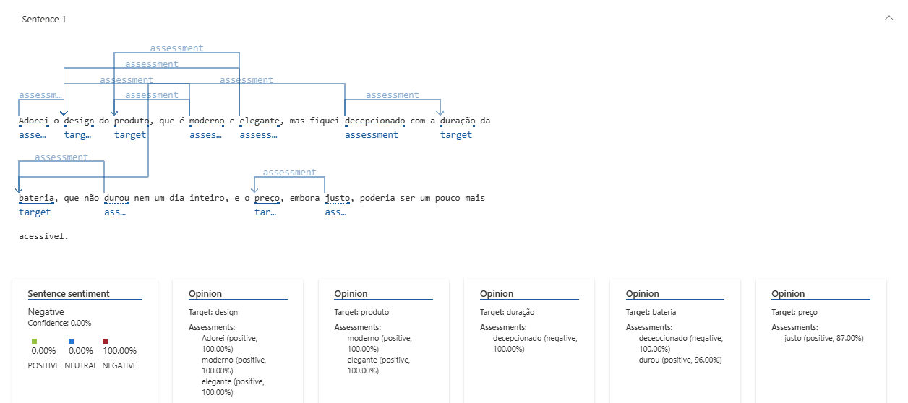

# Análise de Sentimentos com Azure AI Language

## Descrição do Projeto
Este projeto tem como objetivo demonstrar o uso do Azure AI Language para análise de sentimentos em textos. Utilizei o Language Studio para analisar o sentimento de frases e documentei o processo neste repositório.

## Passo a Passo
1. Criei um recurso do Azure AI Language no Azure Portal.
2. Acessei o Language Studio e carreguei as frases do arquivo `frases.txt`.
3. Utilizei o modelo de Análise de Sentimentos para obter as pontuações de sentimento de cada frase.

## Resultados
Exemplo Sentença 1:

Exemplo Sentença 3:

Exemplo Sentença 3:

## Insights
Aprendi que a análise de sentimentos pode ser aplicada em diversas áreas, como atendimento ao cliente, monitoramento de redes sociais e pesquisa de mercado. O Azure AI Language facilita essa análise com alta precisão.

## Link para o Repositório
[Clique aqui para acessar o repositório](https://github.com/seu-usuario/analise-sentimentos-azure-ai)
